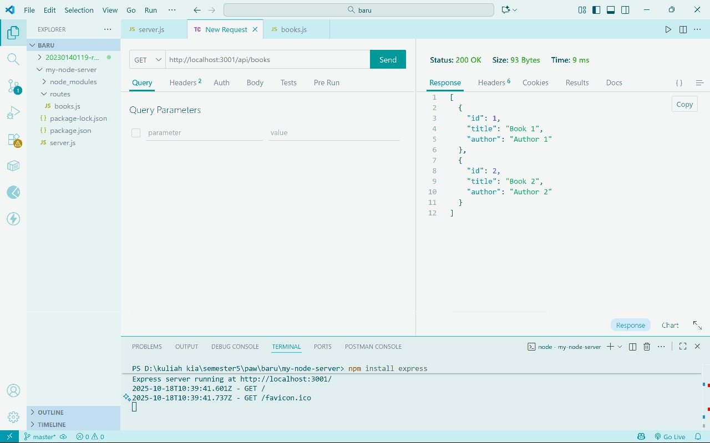
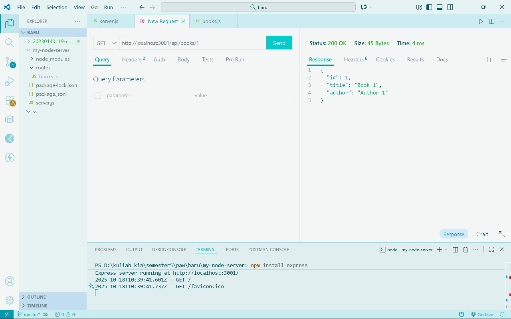
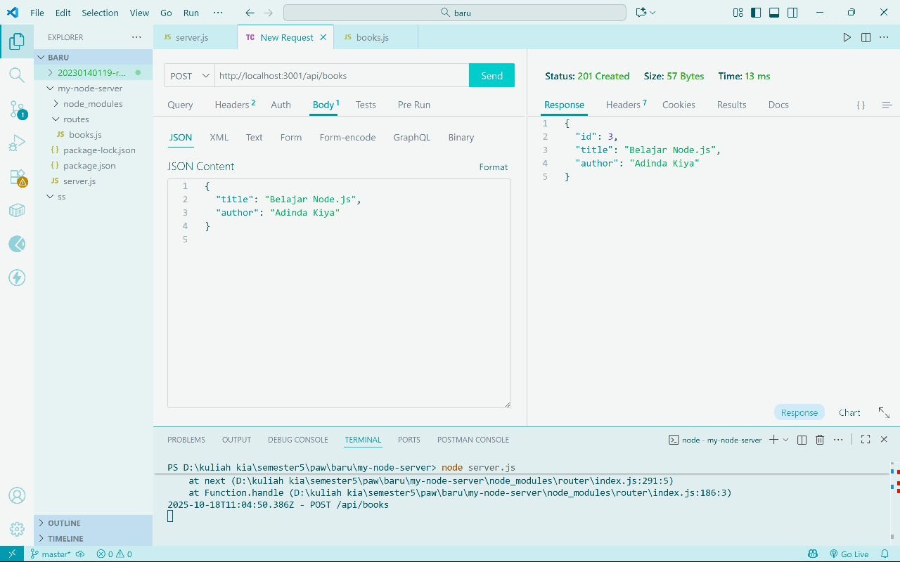
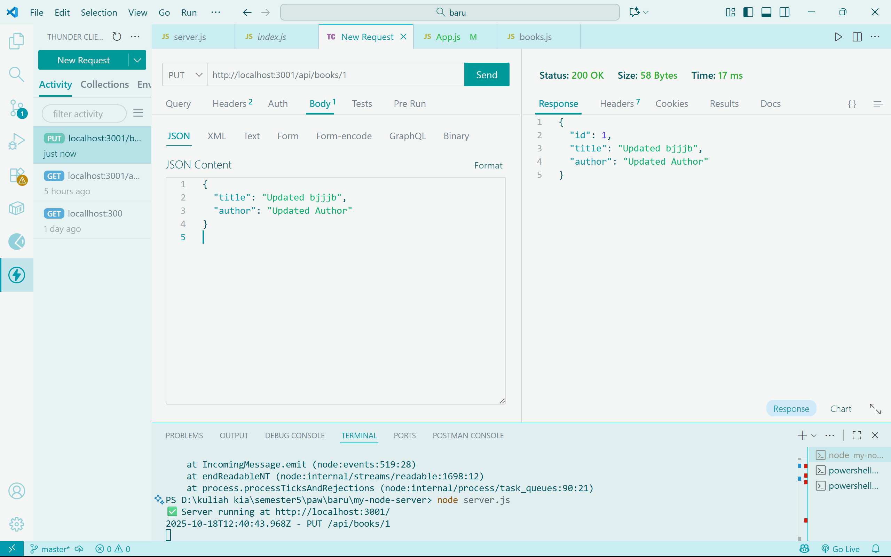
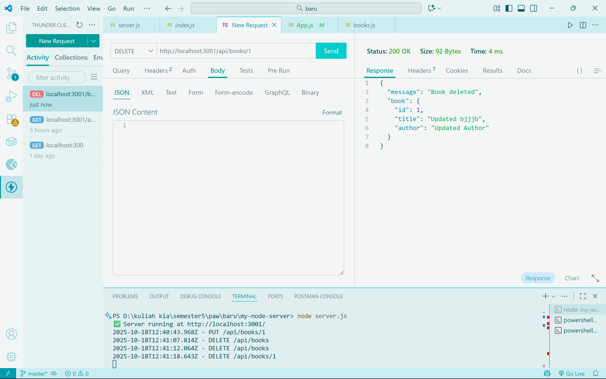

# Tugas 2 - API Endpoint CRUD Buku

Dokumentasi screenshot endpoint CRUD untuk aplikasi `my-library-app`.

## 1. GET /api/books
Deskripsi: Menampilkan semua buku.  
Screenshot:  

## 2. GET /api/books/:id
Deskripsi: Menampilkan buku berdasarkan ID.  
Screenshot:  

## 3. POST /api/books
Deskripsi: Menambahkan buku baru.  
Screenshot (body & response):  

## 4. PUT /api/books/:id
Deskripsi: Mengupdate buku.  
Screenshot (body & response):  

## 5. DELETE /api/books/:id
Deskripsi: Menghapus buku.  
Screenshot (response):  

> Catatan: Pastikan semua screenshot disimpan di folder `ss/` agar path di atas valid.
